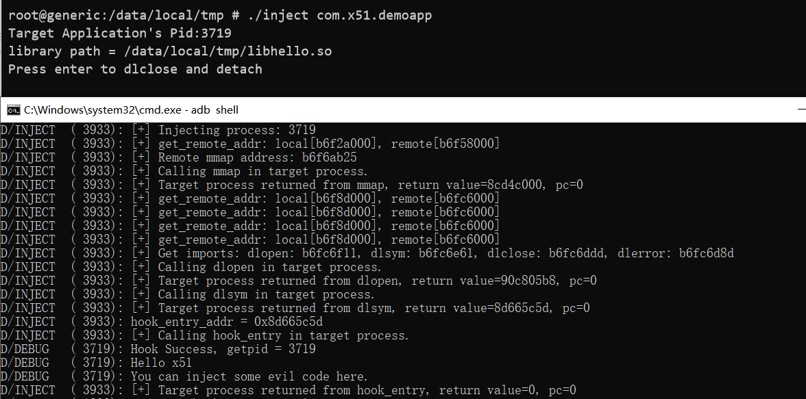
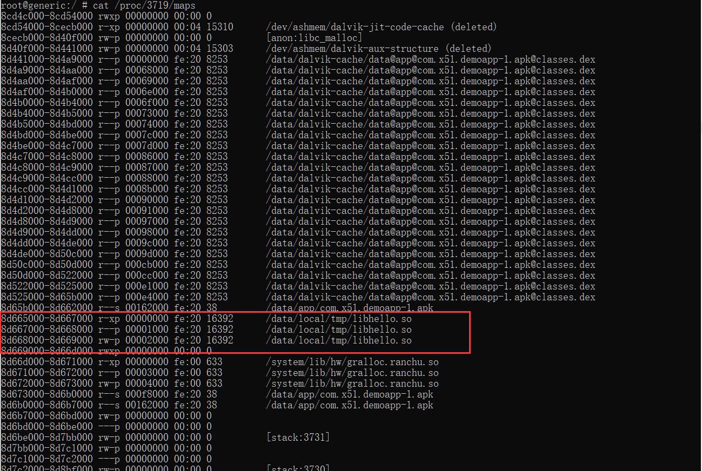

# droidsoject
android应用安全测试时用到的so注入工具.  
binary for android process injection testing.  

## 示例

## How to use it  
```./inject com.x51.demo```  
然后重开一个cmd窗口：```logcat -s "INJECT"```  
注入成功样例日志：  
```D/INJECT  ( 3738): [+] Calling dlclose in target process.
D/INJECT  ( 3738): [+] Target process returned from dlclose, return value=0, pc=b6f590bc
E/WakeLock( 1893): GCM_HB_ALARM release without a matched acquire!
D/INJECT  ( 3933): [+] Injecting process: 3719
D/INJECT  ( 3933): [+] get_remote_addr: local[b6f2a000], remote[b6f58000]
D/INJECT  ( 3933): [+] Remote mmap address: b6f6ab25
D/INJECT  ( 3933): [+] Calling mmap in target process.
D/INJECT  ( 3933): [+] Target process returned from mmap, return value=8cd4c000, pc=0
D/INJECT  ( 3933): [+] get_remote_addr: local[b6f8d000], remote[b6fc6000]
D/INJECT  ( 3933): [+] get_remote_addr: local[b6f8d000], remote[b6fc6000]
D/INJECT  ( 3933): [+] get_remote_addr: local[b6f8d000], remote[b6fc6000]
D/INJECT  ( 3933): [+] get_remote_addr: local[b6f8d000], remote[b6fc6000]
D/INJECT  ( 3933): [+] Get imports: dlopen: b6fc6f11, dlsym: b6fc6e61, dlclose: b6fc6ddd, dlerror: b6fc6d8d
D/INJECT  ( 3933): [+] Calling dlopen in target process.
D/INJECT  ( 3933): [+] Target process returned from dlopen, return value=90c805b8, pc=0
D/INJECT  ( 3933): [+] Calling dlsym in target process.
D/INJECT  ( 3933): [+] Target process returned from dlsym, return value=8d665c5d, pc=0
D/INJECT  ( 3933): hook_entry_addr = 0x8d665c5d
D/INJECT  ( 3933): [+] Calling hook_entry in target process.
D/DEBUG   ( 3719): Hook Success, getpid = 3719
D/DEBUG   ( 3719): Hello x51
D/DEBUG   ( 3719): You can inject some evil code here.
D/INJECT  ( 3933): [+] Target process returned from hook_entry, return value=0, pc=0
```  
查看目标进程mmap分布

## Quick Start(Windows)  
```quickstart.bat``` 
```adb shell su -c setenforce 0
adb push inject /data/local/tmp
adb push libhello.so /data/local/tmp
adb shell chmod 777 /data/local/tmp/inject
adb shell chmod 777 /data/local/tmp/libhello.so
adb shell su -c /data/local/tmp/inject com.x51.demoapp
pause
```  
## Notice
1、乙方Android测试工具之一  
2、libhello.so的路径在inject中写死了，```/data/local/tmp/libhello.so```，可以改但没必要.  
